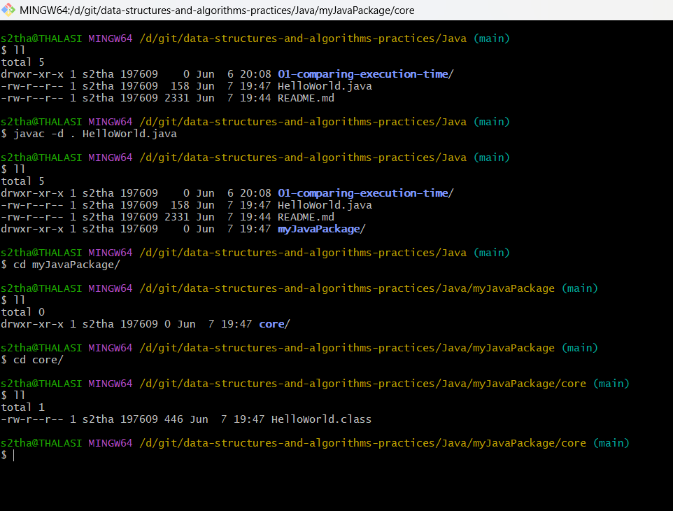

# data-structures-and-algorithms-practices

## Create a Java source file

Use a text editor to create a file with a .java extension (e.g., MyProgram.java).

Write your Java code in this file. For example:

    package myJavaPackage.core;

    public class HelloWorld {
        public static void main(String[] args) {
            System.out.println("Hello, World!");
        }
    }

In the first line, I have written the package as package myJavaPackage.core. 

This indicates that I want to create a folder named myJavaPackage. 

Then, I want to create another folder under that named core. 

Finally, I want to create the class file of my Java code inside the core folder.

The directory tree looks like this: myJavaPackage > core.

## Compile the Java source file

    Open a terminal or command prompt.

    Navigate to the directory where you saved the .java file using the cd command. 

    For compiling this type of Java code with the packages, we use the command 

            javac -d . file_name_with_the_extension.

  As for now, I am using the Main.java file, so I will apply the command 
  
             javac -d . HelloWorld.java. 
  
  This will create a folder named myJavaPackage, then create another folder named core under the myJavaPackage folder under the directory where my source file is now.

    The_Directory_Where_I_Have_Kept_My_Source_Code

            myJavaPackage folder
            Source folder

## Run the Java program

Now if we want to run the .class file, then we need to change the command a little, as we need to provide the directory of the .class file in the terminal window.

We use the command to run the Java program with packages, 

        java directory_of_the_class_file.the_class_file_name_without_the_extension.

For example:

    java myJavaPackage.core.HelloWorld

In the first line, I have written the package as package myJavaPackage.core. This indicates that I want to create a folder named myJavaPackage. Then, I want to create another folder under that named core. Finally, I want to create the class file of my Java code inside the Source folder.

The directory tree looks like this: myJavaPackage > core.

