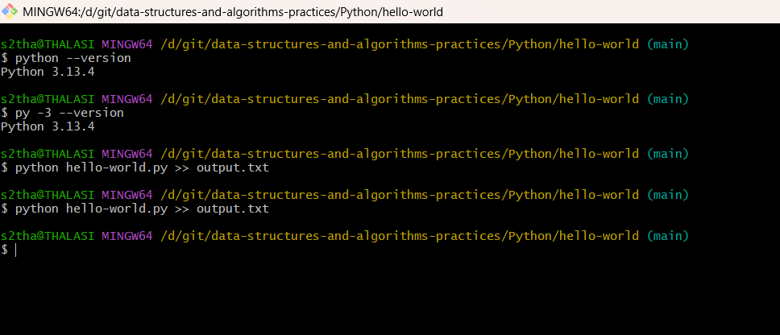
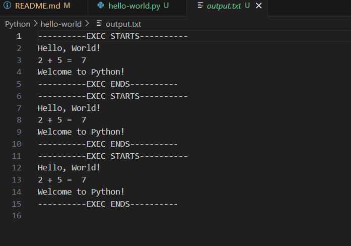

# data-structures-and-algorithms-practices

## Running Python Files in the Terminal

To run a Python script from the terminal, you need to use the Python interpreter. Open a terminal and navigate to the directory where your Python file is located. Then, type the following command:

        python filename.py

Press Enter, and the Python interpreter will execute the script. You will see the output of your script displayed in the terminal.

        python hello-world.py

        python hello-world.py >> output.txt

### Passing Command Line Arguments:

    Python scripts can accept command line arguments, which are values passed to the script when it is executed. To pass command line arguments to your Python script, add them after the script name when running the script. For example:

        python filename.py arg1 arg2

