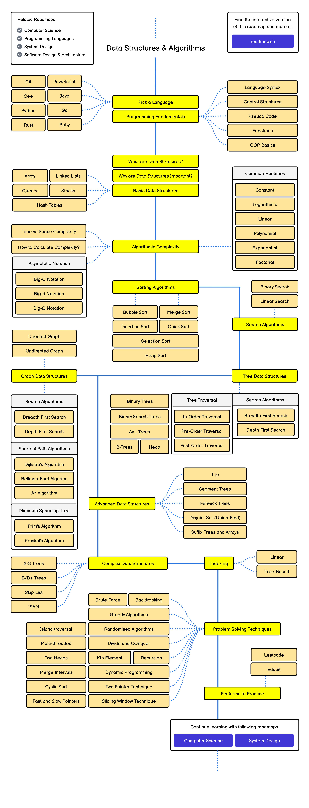
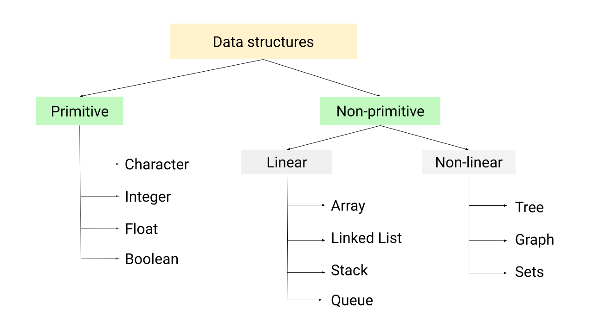

# data-structures-and-algorithms-practices

# Roadmap

# Data Structures:

# Algorithms

Algorithms are classified in various ways, broadly based on their purpose, strategy, or approach to problem-solving. 

## Algorithm Analysis

The design of an algorithm involves choosing appropriate data structures and algorithms to solve a specific problem efficiently.

If algorithm A takes less time to solve the same problem than does algorithm B, then algorithm A is considered better.

Another important factor in comparing two algorithms is the amount of memory required to solve a given problem. 

It's important to consider the time and space complexity of an algorithm, 
    which describes how its performance scales with the size of the input. 
   

Here's a more detailed breakdown:

## By Purpose/Use Case:

####    Searching Algorithms:

    These algorithms are designed to locate specific data within a data structure. 
    Examples include linear search, binary search, and graph search algorithms.

####    Sorting Algorithms:

    These algorithms arrange data in a specific order (ascending or descending). 
    Examples include bubble sort, insertion sort, merge sort, and quicksort. 

####    Graph Algorithms:

    These algorithms are used to solve problems related to graphs, 
    such as finding the shortest path between nodes or detecting cycles. 

## By Problem-Solving Strategy:

####    Brute Force Algorithms:

    These algorithms exhaustively try all possible solutions to a problem until 
    the correct one is found.
    
####    Greedy Algorithms:

    These algorithms make locally optimal choices at each step, hoping to find a 
    global optimal solution. 

####    Divide and Conquer Algorithms:

    These algorithms break a problem down into smaller subproblems, solve them recursively, 
    and combine the solutions to solve the original problem. 

####    Dynamic Programming Algorithms:

    These algorithms break a problem down into overlapping subproblems, solve each subproblem once, 
    and store the solutions to avoid recomputation. 

####    Recursive Algorithms:

    These algorithms solve a problem by calling themselves with smaller inputs 
    until a base case is reached.

####    Backtracking Algorithms:

    These algorithms explore possible solutions by building them step-by-step and backtracking 
    when a path is determined to be incorrect. 

####    Randomized Algorithms:

    These algorithms incorporate randomness into their logic to find approximate solutions or improve performance.

## Other Important Categories:

####    Hashing Algorithms: 

    These algorithms convert data into a fixed-size value, often for fast lookups 
    or data comparisons. 
        
####    Machine Learning Algorithms: 

    These algorithms learn from data to make predictions or decisions. 

####    Deterministic vs. Non-deterministic: 

    Deterministic algorithms always produce the same output for a given input, 
    while non-deterministic algorithms may produce different outputs.
